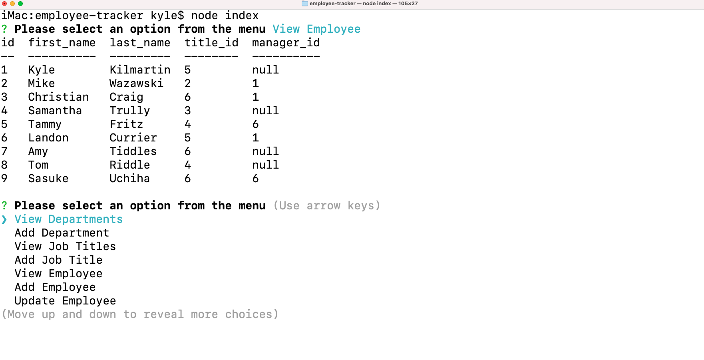

# Employee-Tracker

 ## Table of contents
* [Installation](#installation)
* [Usage](#usage)
* [Credits](#credits)
* [License](#license)

---
## Description

  This is a terminal based application that can store data and be updated to show your work places employees, job titles, and departments

## Installation
  Copy the repository to your local computer, run npm install, then use node index to start the application in the terminal and follow the prompts to view and update information

## Usage
  
  [![watch the video]](https://youtu.be/FrJCjnAylQg)
  

  ---

## Credits
  No colaborators were used to make this projct

  ### Have any questions or concerns? Contact me!
https://github.com/KyleKilmartin371/employee-tracker

kylekilmartin371@gmail.com

  ---
### License
  https://opensource.org/licenses/MIT
